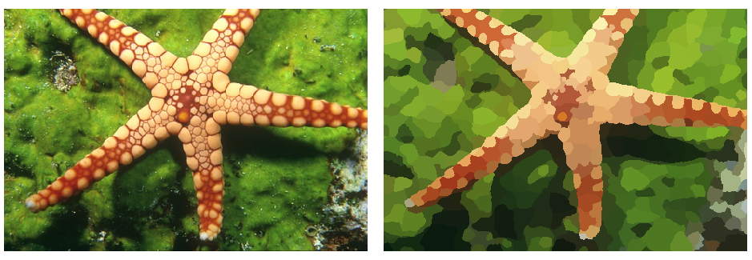
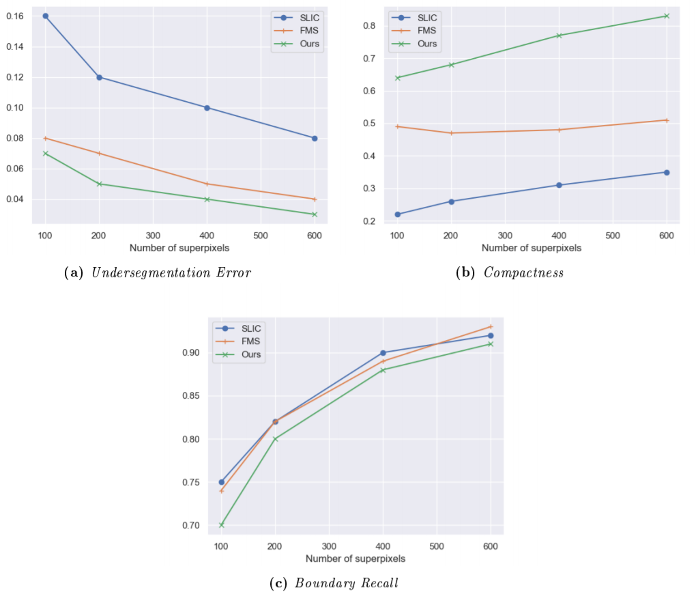

# Research internship - Image segmentation by superpixels

> :warning: WIP

Keywords: Python, PyTorch, Deep Learning, Image Segmentation

## Table of contents

1. [ Introduction ](#1-introduction)
2. [ Project structure ](#2-project-structure)
3. [ Neural Network ](#3-neural-network)  
    3.1. [ Architecture ](#31-architecture)  
    3.2. [ Hyperparameters ](#34-hyperparameters)
4. [ Results ](#4-results)
5. [ Resources ](#5-resources)

## 1. Introduction

## 2. Project structure

The project `superpixel-segmentation` has the following structure:

- `cnn`: scripts for convolutional neural network
- `segm`: info about superpixel segmentation
- `report`: sources for report (pdf version can be found [here](report/main.pdf))
- `presentation`: sources for public presentation (pdf version can be found [here](presentation/main.pdf))

## 3. Neural Network

### 3.1. Architecture
The primary architecture of our network is the Context Aggregation Network (CAN). It gradually aggregates contextual information without losing resolution through the use of dilated convolutions, whose field of view increases exponentially over the network layers. This exponential growth grants a global information aggregation with a compact structure. Please view [the report](report/main.pdf) for references.

Here is the architecture of our Context Aggregation Network:

| Layer `L_s`       | 1   | 2   | 3   | 4   | 5   | 6   | 7   |
|-------------------|-----|-----|-----|-----|-----|-----|-----|
| Input `w_s`       | 3   | 24  | 24  | 24  | 24  | 24  | 24  |
| Output `w_{s+1}`  | 24  | 24  | 24  | 24  | 24  | 24  | 3   |
| Receptive field   | 3x3 | 3x3 | 3x3 | 3x3 | 3x3 | 3x3 | 1x1 |
| Dilation `r_s`    | 1   | 2   | 4   | 8   | 16  | 1   | 1   |
| Padding           | 1   | 2   | 4   | 8   | 16  | 1   | 0   |
| ABN               | Yes | Yes | Yes | Yes | Yes | Yes | Yes |
| LReLU             | 0.2 | 0.2 | 0.2 | 0.2 | 0.2 | 0.2 | No  |

### 3.2. Hyperparameters

In [the report](report/main.pdf), we discuss how the hyperparameters impact the model's performances metrics and temporal efficiency and we conduct experiments to find a good-performing architecture.
We found that the following values worked well on the BSD dataset:

| batch\_size | epochs | `d` | `lr_0` | decay for `lr_0`      | `alpha_TV` |
|-------------|--------|-----|--------|-----------------------|------------|
| 32          | 80     | 7   | 10^\-2 | 10^\-3 after 10 epochs| 0          |

## 4. Results

_Application of the model to an image of the BSD500. From left to right, up to down: original image, output image of the neural network, superpixel segmentation of the output image overlaying on original image, and superpixel segmented image with each superpixel being displayed with the average color of the pixels belonging to it._

Below are evaluated the metrics for some superpixel segmentation algorithms: SLIC, FMS and our algorithm (see [report](report/main.pdf) for references). We use the SLIC algorithm as a reference to evaluate the performances of our model.

Our model yields very good results: the undersegmentation sees a 0.01 improvement, and the compactness is way better (improvement of 0.23). The boundary recall is slightly smaller for our model than for the SLIC algorithm, but this is not a problem as the SLIC compactness is very low. The contours oscillate and thus intersect more with the ground truth image outlines.

## 5. Resources

This project was inspired by:

## To do

- [ ] `cnn`
    - [x] sort `cnn` codes (modules, net)
    - [ ] `README.md` in `cnn`
    - [ ] put `cnn\results\images\results.py` file in `notebooks`
    - [ ] adapt files to new structure of repository
    - [ ] `README.md` in `cnn\results`
- [ ] `data`
    - [ ] `README.md` in `data`
- [ ] `notebooks`
    - [ ] convert `.py` files into `notebooks`
    - [ ] `README.md` in `notebooks`
- [x] `report`
- [x] `segm`
    - [x] `README.md` in `segm`
- [ ] this `README.md`
