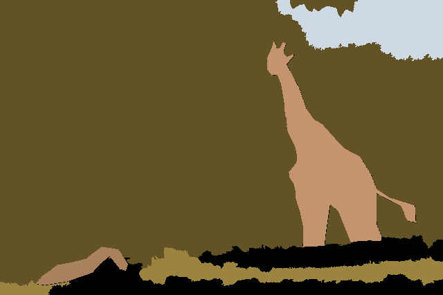

# data

## 1 - COCO

The training of the neural network was performed on a modified version of the [COCO dataset](http://cocodataset.org/#home). This dataset gathers images of complex everyday scenes containing common objects in their natural context and can be used for object detection, segmentation and captioning. The COCO dataset contains a huge number of images, but its segmentations lack precision. As it has been labeled by hand in an approximative way, the boundaries of its segmented images are often imprecise. We subsequently use a version of the Eikonal-based superpixel algorithm to process the images.

_An image of the COCO dataset._

## 2 - BSD

To assess its performances, we evaluated our model on the [Berkeley Segmentation Dataset 500 (BSDS500)](https://www2.eecs.berkeley.edu/Research/Projects/CS/vision/grouping/resources.html). It only contains 500 images but provides very qualitative ground truth manual segmentations for each image.
